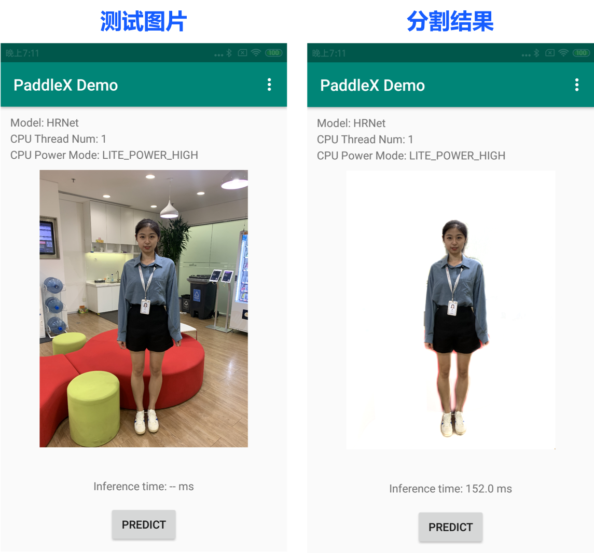

# HumanSeg人像分割模型

本教程基于PaddleX核心分割模型实现人像分割，开放预训练模型和测试数据、支持视频流人像分割、提供模型Fine-tune到Paddle Lite移动端部署的全流程应用指南。

## 目录

* [预训练模型和测试数据](#1)
* [快速体验视频流人像分割](#2)
* [模型Fine-tune](#3)
* [Paddle Lite移动端部署](#4)


## <h2 id="1">预训练模型和测试数据</h2>

#### 预训练模型

本案例开放了两个在大规模人像数据集上训练好的模型，以满足服务器端场景和移动端场景的需求。使用这些模型可以快速体验视频流人像分割，也可以部署到移动端进行实时人像分割，也可以用于完成模型Fine-tuning。

| 模型类型 | Checkpoint Parameter | Inference Model | Quant Inference Model | 备注 |
| --- | --- | --- | ---| --- |
| HumanSeg-server  | [humanseg_server_params](https://bj.bcebos.com/paddlex/examples/human_seg/models/humanseg_server_params.tar) | [humanseg_server_inference](https://bj.bcebos.com/paddlex/examples/human_seg/models/humanseg_server_inference.tar) | -- | 高精度模型，适用于服务端GPU且背景复杂的人像场景， 模型结构为Deeplabv3+/Xcetion65, 输入大小（512， 512） |
| HumanSeg-mobile | [humanseg_mobile_params](https://bj.bcebos.com/paddlex/examples/human_seg/models/humanseg_mobile_params.tar) | [humanseg_mobile_inference](https://bj.bcebos.com/paddlex/examples/human_seg/models/humanseg_mobile_inference.tar) | [humanseg_mobile_quant](https://bj.bcebos.com/paddlex/examples/human_seg/models/humanseg_mobile_quant.tar) | 轻量级模型, 适用于移动端或服务端CPU的前置摄像头场景，模型结构为HRNet_w18_small_v1，输入大小（192， 192）  |

> * Checkpoint Parameter为模型权重，用于Fine-tuning场景，包含`__params__`模型参数和`model.yaml`基础的模型配置信息。
> * Inference Model和Quant Inference Model为预测部署模型，包含`__model__`计算图结构、`__params__`模型参数和`model.yaml`基础的模型配置信息。
> * 其中Inference Model适用于服务端的CPU和GPU预测部署，Qunat Inference Model为量化版本，适用于通过Paddle Lite进行移动端等端侧设备部署。


预训练模型的存储大小和推理时长如下所示，其中移动端模型的运行环境为cpu：骁龙855，内存：6GB，图片大小：192*192

| 模型 | 模型大小 | 计算耗时 |
| --- | --- | --- |
|humanseg_server_inference| 158M | - |
|humanseg_mobile_inference | 5.8 M | 42.35ms |
|humanseg_mobile_quant | 1.6M | 24.93ms |

执行以下脚本下载全部的预训练模型：

* 下载PaddleX源码：

```bash
git clone https://github.com/PaddlePaddle/PaddleX
```

* 下载预训练模型的代码位于`PaddleX/examples/human_segmentation`，进入该目录：

```bash
cd PaddleX/examples/human_segmentation
```

* 执行下载

```bash
python pretrain_weights/download_pretrain_weights.py
```

#### 测试数据

[supervise.ly](https://supervise.ly/)发布了人像分割数据集**Supervisely Persons**, 本案例从中随机抽取一小部分数据并转化成PaddleX可直接加载的数据格式，运行以下代码可下载该数据、以及手机前置摄像头拍摄的人像测试视频`video_test.mp4`.

* 下载测试数据的代码位于`PaddleX/xamples/human_segmentation`，进入该目录并执行下载：

```bash
python data/download_data.py
```

## <h2 id="2">快速体验视频流人像分割</h2>

#### 前置依赖

* PaddlePaddle >= 1.8.0
* Python >= 3.5
* PaddleX >= 1.0.0

安装的相关问题参考[PaddleX安装](../../docs/install.md)

* 下载PaddleX源码：

```bash
git clone https://github.com/PaddlePaddle/PaddleX
```

* 视频流人像分割和背景替换的执行文件均位于`PaddleX/examples/human_segmentation`，进入该目录：

```bash
cd PaddleX/examples/human_segmentation
```

### 光流跟踪辅助的视频流人像分割

本案例将DIS（Dense Inverse Search-basedmethod）光流跟踪算法的预测结果与PaddleX的分割结果进行融合，以此改善视频流人像分割的效果。运行以下代码进行体验，以下代码位于`PaddleX/xamples/human_segmentation`：

* 通过电脑摄像头进行实时分割处理

```bash
python video_infer.py --model_dir pretrain_weights/humanseg_mobile_inference
```
* 对离线人像视频进行分割处理

```bash
python video_infer.py --model_dir pretrain_weights/humanseg_mobile_inference --video_path data/video_test.mp4
```

视频分割结果如下所示：


### 人像背景替换

本案例还实现了人像背景替换功能，根据所选背景对人像的背景画面进行替换，背景可以是一张图片，也可以是一段视频。人像背景替换的代码位于`PaddleX/xamples/human_segmentation`，进入该目录并执行：

* 通过电脑摄像头进行实时背景替换处理, 通过'--background_video_path'传入背景视频
```bash
python bg_replace.py --model_dir pretrain_weights/humanseg_mobile_inference --background_image_path data/background.jpg
```

* 对人像视频进行背景替换处理, 通过'--background_video_path'传入背景视频
```bash
python bg_replace.py --model_dir pretrain_weights/humanseg_mobile_inference --video_path data/video_test.mp4 --background_image_path data/background.jpg
```

* 对单张图像进行背景替换
```bash
python bg_replace.py --model_dir pretrain_weights/humanseg_mobile_inference --image_path data/human_image.jpg --background_image_path data/background.jpg
```

背景替换结果如下：


**注意**:

* 视频分割处理时间需要几分钟，请耐心等待。

* 提供的模型适用于手机摄像头竖屏拍摄场景，宽屏效果会略差一些。

## <h2 id="3">模型Fine-tune</h2>

#### 前置依赖

* PaddlePaddle >= 1.8.0
* Python >= 3.5
* PaddleX >= 1.0.0

安装的相关问题参考[PaddleX安装](../../docs/install.md)

* 下载PaddleX源码：

```bash
git clone https://github.com/PaddlePaddle/PaddleX
```

* 人像分割训练、评估、预测、模型导出、离线量化的执行文件均位于`PaddleX/examples/human_segmentation`，进入该目录：

```bash
cd PaddleX/examples/human_segmentation
```

### 模型训练

使用下述命令进行基于预训练模型的模型训练，请确保选用的模型结构`model_type`与模型参数`pretrain_weights`匹配。如果不需要本案例提供的测试数据，可更换数据、选择合适的模型并调整训练参数。

```bash
# 指定GPU卡号（以0号卡为例）
export CUDA_VISIBLE_DEVICES=0
# 若不使用GPU，则将CUDA_VISIBLE_DEVICES指定为空
# export CUDA_VISIBLE_DEVICES=
python train.py --model_type HumanSegMobile \
--save_dir output/ \
--data_dir data/mini_supervisely \
--train_list data/mini_supervisely/train.txt \
--val_list data/mini_supervisely/val.txt \
--pretrain_weights pretrain_weights/humanseg_mobile_params \
--batch_size 8 \
--learning_rate 0.001 \
--num_epochs 10 \
--image_shape 192 192
```
其中参数含义如下：
* `--model_type`: 模型类型，可选项为：HumanSegServer和HumanSegMobile
* `--save_dir`: 模型保存路径
* `--data_dir`: 数据集路径
* `--train_list`: 训练集列表路径
* `--val_list`: 验证集列表路径
* `--pretrain_weights`: 预训练模型路径
* `--batch_size`: 批大小
* `--learning_rate`: 初始学习率
* `--num_epochs`: 训练轮数
* `--image_shape`: 网络输入图像大小（w, h）

更多命令行帮助可运行下述命令进行查看：
```bash
python train.py --help
```
**注意**：可以通过更换`--model_type`变量与对应的`--pretrain_weights`使用不同的模型快速尝试。

### 评估

使用下述命令对模型在验证集上的精度进行评估：

```bash
python eval.py --model_dir output/best_model \
--data_dir data/mini_supervisely \
--val_list data/mini_supervisely/val.txt \
--image_shape 192 192
```
其中参数含义如下：
* `--model_dir`: 模型路径
* `--data_dir`: 数据集路径
* `--val_list`: 验证集列表路径
* `--image_shape`: 网络输入图像大小（w, h）

### 预测

使用下述命令对测试集进行预测，预测可视化结果默认保存在`./output/result/`文件夹中。
```bash
python infer.py --model_dir output/best_model \
--data_dir data/mini_supervisely \
--test_list data/mini_supervisely/test.txt \
--save_dir output/result \
--image_shape 192 192
```
其中参数含义如下：
* `--model_dir`: 模型路径
* `--data_dir`: 数据集路径
* `--test_list`: 测试集列表路径
* `--image_shape`: 网络输入图像大小（w, h）

### 模型导出

在服务端部署的模型需要首先将模型导出为inference格式模型，导出的模型将包括`__model__`、`__params__`和`model.yml`三个文名，分别为模型的网络结构，模型权重和模型的配置文件（包括数据预处理参数等等）。在安装完PaddleX后，在命令行终端使用如下命令完成模型导出：

```bash
paddlex --export_inference --model_dir output/best_model \
--save_dir output/export
```
其中参数含义如下：
* `--model_dir`: 模型路径
* `--save_dir`: 导出模型保存路径

### 离线量化
```bash
python quant_offline.py --model_dir output/best_model \
--data_dir data/mini_supervisely \
--quant_list data/mini_supervisely/val.txt \
--save_dir output/quant_offline \
--image_shape 192 192
```
其中参数含义如下：
* `--model_dir`: 待量化模型路径
* `--data_dir`: 数据集路径
* `--quant_list`: 量化数据集列表路径，一般直接选择训练集或验证集
* `--save_dir`: 量化模型保存路径
* `--image_shape`: 网络输入图像大小（w, h）

## <h2 id="4">Paddle Lite移动端部署</h2>

本案例将人像分割模型在移动端进行部署，部署流程展示如下，通用的移动端部署流程参见[Paddle Lite移动端部署](../../docs/deploy/paddlelite/android.md)。

### 1. 将PaddleX模型导出为inference模型

本案例使用humanseg_mobile_quant预训练模型，该模型已经是inference模型，不需要再执行模型导出步骤。如果不使用预训练模型，则执行上一章节`模型训练`中的`模型导出`将自己训练的模型导出为inference格式。

### 2. 将inference模型优化为Paddle Lite模型

下载并解压 [模型优化工具opt](https://bj.bcebos.com/paddlex/deploy/lite/model_optimize_tool_11cbd50e.tar.gz)，进入模型优化工具opt所在路径后，执行以下命令：

``` bash
./opt --model_file=<model_path> \
      --param_file=<param_path> \
      --valid_targets=arm \
      --optimize_out_type=naive_buffer \
      --optimize_out=model_output_name
```

|  参数   | 说明  |
|  ----  | ----  |
| --model_file  | 导出inference模型中包含的网络结构文件：`__model__`所在的路径|
| --param_file  | 导出inference模型中包含的参数文件：`__params__`所在的路径|
| --valid_targets  |指定模型可执行的backend，这里请指定为`arm`|
| --optimize_out_type | 输出模型类型，目前支持两种类型：protobuf和naive_buffer，其中naive_buffer是一种更轻量级的序列化/反序列化，这里请指定为`naive_buffer`|
| --optimize_out | 输出模型的名称 |

更详细的使用方法和参数含义请参考: [使用opt转化模型](https://paddle-lite.readthedocs.io/zh/latest/user_guides/opt/opt_bin.html)

### 3. 移动端预测

PaddleX提供了基于PaddleX Android SDK的安卓demo，可供用户体验图像分类、目标检测、实例分割和语义分割，该demo位于`PaddleX/deploy/lite/android/demo`，用户将模型、配置文件和测试图片拷贝至该demo下进行预测。

#### 3.1 前置依赖

* Android Studio 3.4
* Android手机或开发板

#### 3.2 拷贝模型、配置文件和测试图片

* 将Lite模型（.nb文件）拷贝到`PaddleX/deploy/lite/android/demo/app/src/main/assets/model/`目录下, 根据.nb文件的名字，修改文件`PaddleX/deploy/lite/android/demo/app/src/main/res/values/strings.xml`中的`MODEL_PATH_DEFAULT`；

* 将配置文件（.yml文件）拷贝到`PaddleX/deploy/lite/android/demo/app/src/main/assets/config/`目录下，根据.yml文件的名字，修改文件`PaddleX/deploy/lite/android/demo/app/src/main/res/values/strings.xml`中的`YAML_PATH_DEFAULT`；

* 将测试图片拷贝到`PaddleX/deploy/lite/android/demo/app/src/main/assets/images/`目录下，根据图片文件的名字，修改文件`PaddleX/deploy/lite/android/demo/app/src/main/res/values/strings.xml`中的`IMAGE_PATH_DEFAULT`。

#### 3.3 导入工程并运行

* 打开Android Studio，在"Welcome to Android Studio"窗口点击"Open an existing Android Studio project"，在弹出的路径选择窗口中进入`PaddleX/deploy/lite/android/demo`目录，然后点击右下角的"Open"按钮，导入工程；

* 通过USB连接Android手机或开发板；

* 工程编译完成后，点击菜单栏的Run->Run 'App'按钮，在弹出的"Select Deployment Target"窗口选择已经连接的Android设备，然后点击"OK"按钮；

* 运行成功后，Android设备将加载一个名为PaddleX Demo的App，默认会加载一个测试图片，同时还支持拍照和从图库选择照片进行预测。

测试图片及其分割结果如下所示：


